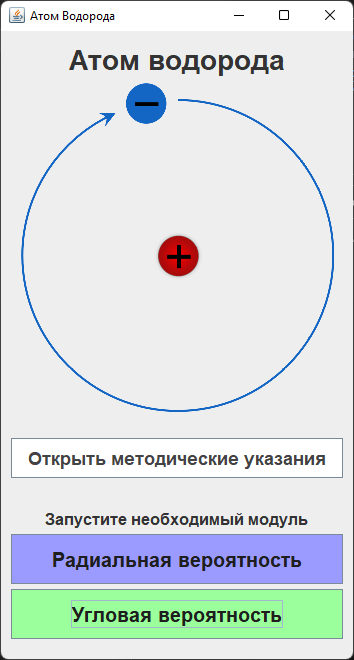
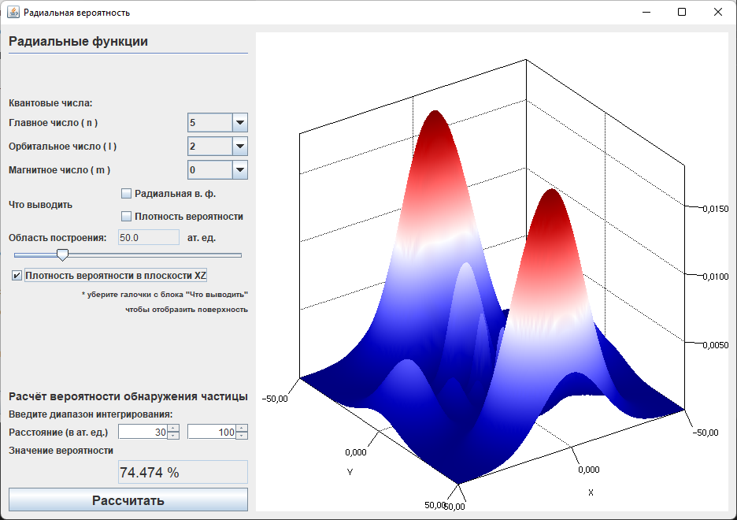
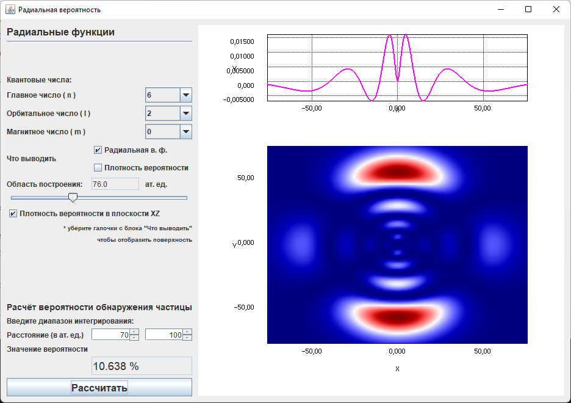
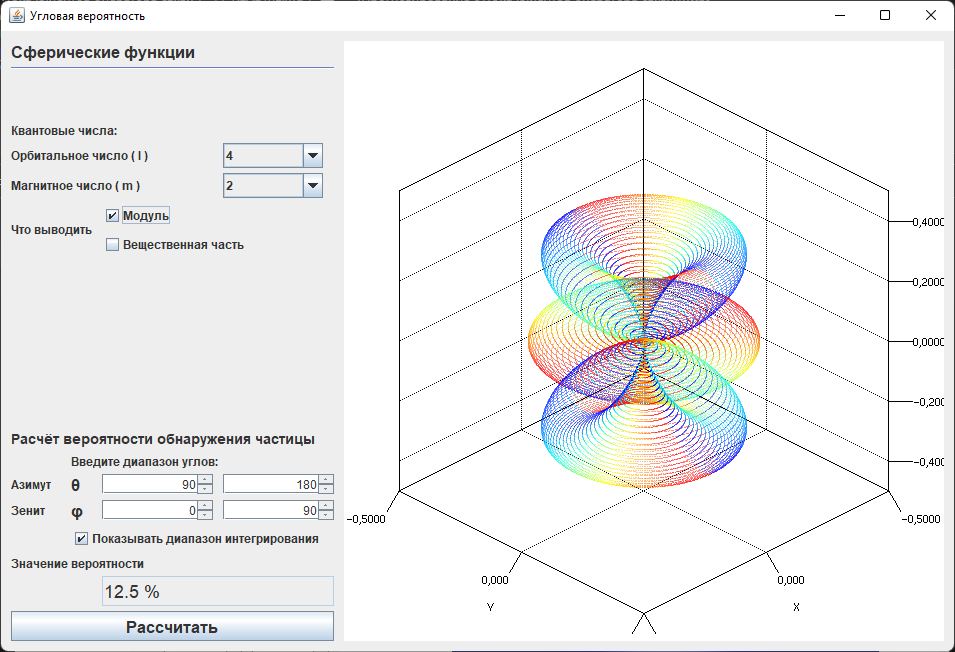

# Hydrogen electron orbitals

## Visualizing the hydrogen electron orbitals
This app visualizes some quantum states of the hydrogen atom based on numerical solution of Schrodinger equation.
$$\Delta\psi + \frac{2m}{\hbar^2}(E+\frac{e^2}{r})\psi=0$$
where $m$ - mass of the electron, $\hbar$ - Planck's reduced constant, $E$ - total energy of the quantum state described by the wave function $\psi$

The application consists of two modules for calculating different components of the density of states: radial and angular

### It was presented at the physics conference
> Алёшин М. С., Прохоренко А. В. [Применение библиотек Open Source Physics и Jzy3d для моделирования виртуальных лабораторных работ по атомным процессам](https://ffpio.amursu.ru/upload/ffpio_2019/doi/tfim/Alyoshin.pdf) Физика: фундаментальные и прикладные исследования, образование: материалы XVII региональной научной конференции, Благовещенск : Амурский гос. ун-т, Благовещенский гос. пед. ун-т, 2019
> (_Aleshin M. S., Prokhorenko A. V. [Application of Open source physics and jzy3d libraries for modeling virtual laboratory works on atomic processes](https://ffpio.amursu.ru/upload/ffpio_2019/doi/tfim/Alyoshin.pdf
). Physics: Fundamental and Applied Research, Education: Proceedings of the XVII Regional Scientific Conference, Blagoveshchensk, 2019._)

## Libraries:

- Standard java libraries: `io`, `imageio`, `awt`, `swing`
- `jz3d` - [Open source API for 3d charts](http://www.jzy3d.org/)  
  Plotting
- `osp` - [Open Source Physics library](https://www.compadre.org/osp/index.cfm)  
  Solving the Schrödinger equation

`atom.jar` - ready to use app

## Demo screenshots

### Main window

### Radial component of probability module

### Angular component of probability module

